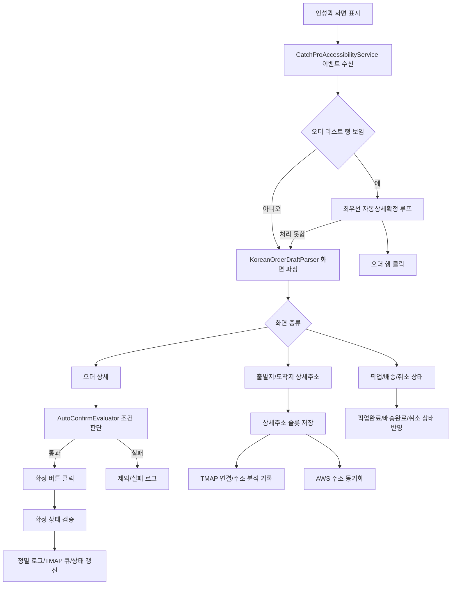

# CatchPro 코드 리서치

작성일: 2026-05-11

이 문서는 현재 폴더 `C:\Users\misoh\TTJ\catchpro`를 읽고 정리한 구조 분석 문서입니다. 현재 구현 상태, 핵심 동작, 그리고 이번 자동상세확정 최적화/오더추적 제거 변경점을 함께 기록했습니다.

## 한 줄 요약

CatchPro는 인성퀵 앱 화면을 Android 접근성 서비스로 읽고, 사용자가 설정한 오더 조건에 맞춰 오더 상세 진입, 자동확정, 자동상세확정, 상세주소 저장, TMAP 연결, 운행 개선용 로그 기록을 수행하는 Android 앱입니다.

핵심 자동화는 거의 전부 `CatchProAccessibilityService.kt`에 모여 있습니다. UI는 Jetpack Compose, 설정은 DataStore, 로그와 이력은 Room을 사용합니다.

## 프로젝트 구성

### 빌드와 기술 스택

- Android Gradle Plugin 기반 Kotlin Android 앱입니다.
- 앱 모듈은 `app` 하나입니다.
- 주요 라이브러리:
  - Jetpack Compose
  - Navigation Compose
  - Hilt
  - Room
  - DataStore Preferences
  - OkHttp
  - Kotlin Serialization
  - Google Play Services Location
- `app/build.gradle.kts` 기준:
  - `compileSdk = 37`
  - `minSdk = 26`
  - `targetSdk = 37`
  - `versionCode = 12`
  - `versionName = "0.1.11"`

주의: 루트 `README.md`는 아직 초기/placeholder 설명에 가깝고, compileSdk 설명도 실제 코드와 다릅니다. 현재 동작 이해에는 `app/src/main` 코드가 기준입니다.

### 주요 디렉터리

```text
app/src/main/java/com/catchpro/app
├── data
│   ├── db                Room DB, DAO, Entity
│   ├── location          현재 위치 제공
│   ├── model             AppSettings 등 설정 모델
│   ├── parser            인성퀵 화면 텍스트 파서
│   ├── repository        설정/이력/로그 저장소
│   └── sync              AWS 주소 동기화 모델/매니저
├── domain
│   ├── model             ParsedOrderDraft, 판단 결과 모델
│   ├── rule              자동확정 평가 로직
│   └── tmap              경로/주소/TMAP 관련 서비스
├── service               접근성 서비스
└── ui                    Compose 화면
```

## 앱 시작 흐름

`MainActivity`가 실행되면 AWS 주소 동기화 매니저를 시작하고 Compose 네비게이션을 띄웁니다. 접근성 서비스가 먼저 살아나는 운행 흐름에서도 같은 싱글톤 매니저를 시작해, 앱 화면을 열지 않은 상태에서 AWS 동기화가 꺼져 있는 일이 생기지 않도록 보강했습니다. `catchpro://route-sync`/공유 인텐트 처리는 제거된 상태라, 주소 동기화는 TMAP 연결 탭의 AWS WebSocket 방식만 사용합니다.

핵심 스니펫:

```kotlin
@AndroidEntryPoint
class MainActivity : ComponentActivity() {
    @Inject
    lateinit var routeAddressCloudSyncManager: RouteAddressCloudSyncManager

    override fun onCreate(savedInstanceState: Bundle?) {
        super.onCreate(savedInstanceState)
        routeAddressCloudSyncManager.start()
        setContent {
            CatchProTheme {
                CatchProNavHost(routeAddressCloudSyncManager = routeAddressCloudSyncManager)
            }
        }
    }
}

@AndroidEntryPoint
class CatchProAccessibilityService : AccessibilityService() {
    @Inject
    lateinit var routeAddressCloudSyncManager: RouteAddressCloudSyncManager

    override fun onServiceConnected() {
        super.onServiceConnected()
        routeAddressCloudSyncManager.start()
    }
}
```

## Android Manifest 기준 동작

앱은 일반 화면 앱이면서 접근성 서비스를 함께 등록합니다.

주요 권한:

- `INTERNET`
- `POST_NOTIFICATIONS`
- `VIBRATE`
- `WAKE_LOCK`
- `ACCESS_COARSE_LOCATION`
- `ACCESS_FINE_LOCATION`

주요 컴포넌트:

- `MainActivity`
  - 런처 Activity
- `CatchProAccessibilityService`
  - `android.permission.BIND_ACCESSIBILITY_SERVICE`
  - 인성퀵/TMAP/카카오맵 화면 감지와 자동화 수행

접근성 설정 파일 `catchpro_accessibility_service.xml`은 아래 이벤트를 구독합니다.

```xml
android:accessibilityEventTypes=
    "typeWindowStateChanged|typeWindowContentChanged|typeViewScrolled|typeViewClicked"
android:accessibilityFlags=
    "flagReportViewIds|flagRetrieveInteractiveWindows"
android:canPerformGestures="true"
android:canTakeScreenshot="true"
android:canRetrieveWindowContent="true"
```

## 화면 구성

하단 탭은 `CatchProNavHost.kt`에 정의되어 있습니다.

현재 노출되는 메인 탭:

- 대시보드
- 오더 조건
- TMAP 연결
- 설정

`HistoryScreen`, `ObservationLogScreen`, `PresetsScreen`도 코드에는 남아 있지만, 현재 일반 하단 탭의 핵심 흐름에서는 내부 분석/레거시 화면 성격이 강합니다. 오더추적 탭은 하단 탭에서 제거되었습니다.

핵심 스니펫:

```kotlin
val topLevelDestinations = listOf(
    TopLevelDestination(Routes.Dashboard, "대시보드", Icons.Outlined.Dashboard),
    TopLevelDestination(Routes.Destinations, "오더 조건", Icons.Outlined.Place),
    TopLevelDestination(Routes.TmapQueue, "TMAP 연결", Icons.Outlined.Navigation),
    TopLevelDestination(Routes.Settings, "설정", Icons.Outlined.Settings),
)
```

## 데이터 저장 구조

### Room DB

DB 이름은 `catchpro.db`, 버전은 4입니다.

엔티티:

- `PresetEntity`
- `DestinationEntity`
- `OrderEventEntity`
- `AccessibilityCaptureEntity`
- `TmapQueueEntryEntity`
- `OperationLogEntity`

핵심 스니펫:

```kotlin
@Database(
    entities = [
        PresetEntity::class,
        DestinationEntity::class,
        OrderEventEntity::class,
        AccessibilityCaptureEntity::class,
        TmapQueueEntryEntity::class,
        OperationLogEntity::class,
    ],
    version = 4,
    exportSchema = true,
)
abstract class CatchProDatabase : RoomDatabase() {
    abstract fun presetDao(): PresetDao
    abstract fun destinationDao(): DestinationDao
    abstract fun orderEventDao(): OrderEventDao
    abstract fun accessibilityCaptureDao(): AccessibilityCaptureDao
    abstract fun tmapQueueDao(): TmapQueueDao
    abstract fun operationLogDao(): OperationLogDao
}
```

### 운행 개선용 정밀 로그

운행 후 분석 목적의 핵심 로그는 `OperationLogEntity`입니다. 현재는 현장 반응속도 분석에 필요한 핵심 루프만 남기도록 범위를 줄였습니다. 정밀로그 DB에는 오더리스트 클릭, 상세 전환 실패, 상세 판단, 확정 버튼 클릭/검증 관련 이벤트만 저장되고, 주소 동기화, 픽업/배송 팝업, TMAP 도착, AWS 동기화 같은 보조 기능 로그는 저장소 입구에서 제외됩니다.

기록 항목:

- 이벤트 타입
- 상태
- 오더 서명
- 모드
- 출처
- 지역
- 업체명
- 오더 제목
- 출발지/도착지
- 의뢰지/상차지/하차지
- 적요상세
- 요금
- 현위치 -> 상차지 직선거리
- 상차지 -> 하차지 직선거리
- 원/km
- 자동 판단 여부
- 수동 검토 여부
- 제외/실패 사유
- 확정 시도 시각, 관측 시각, 경과 ms
- 확정 실패 유형, 인성 실패 문구, 클릭 대상 진단
- 클릭 진단
- 화면 요약
- 원문 컨텍스트
- 생성 시간

핵심 스니펫:

```kotlin
@Entity(
    tableName = "operation_logs",
    indices = [
        Index("createdAtMillis"),
        Index("eventType"),
        Index("status"),
        Index("mode"),
        Index("orderSignature"),
    ],
)
data class OperationLogEntity(
    @PrimaryKey(autoGenerate = true) val id: Long = 0,
    val eventType: String,
    val status: String,
    val orderSignature: String?,
    val mode: String?,
    val source: String?,
    val region: String?,
    val client: String?,
    val orderTitle: String?,
    val origin: String?,
    val destination: String?,
    val requester: String?,
    val pickup: String?,
    val dropoff: String?,
    val detailNote: String?,
    val priceWon: Int?,
    val currentToPickupKm: Double?,
    val pickupToDropoffKm: Double?,
    val farePerKm: Double?,
    val decision: String?,
    val autoConfirmed: Boolean,
    val manualReviewRequired: Boolean,
    val reason: String?,
    val clickDiagnostic: String?,
    val screenSummary: String?,
    val rawContext: String?,
    val createdAtMillis: Long,
)
```

`OperationLogRepository`는 최근 로그 조회, 저장, 전체 삭제, 오래된 로그 정리를 담당합니다.

```kotlin
class OperationLogRepository @Inject constructor(
    private val dao: OperationLogDao,
) {
    fun recentLogs(limit: Int = 200): Flow<List<OperationLogEntity>> =
        dao.recent(limit)

    suspend fun log(log: OperationLogEntity) {
        if (log.eventType !in HotPathEventTypes) return
        dao.insert(log)
        dao.trimToLimit(50_000)
    }
}
```

남기는 정밀로그 이벤트:

- 리스트 클릭: `auto_entry_click`, `auto_entry_click_failed`, `auto_entry_click_retry`, `auto_entry_detail_not_open`
- 확정 판단/제외: `auto_detail_decision`, `auto_entry_detail_skipped`, `manual_input_required`
- 확정 버튼 클릭/검증: `order_confirm_click_attempted`, `order_confirm_click_failed`, `order_confirm_unverified`, `order_confirmed`

### 사용자 이력성 이벤트

`OrderEventEntity`는 더 단순한 오더 이력/실패 이력용입니다. 현재 핵심 분석은 `OperationLogEntity` 중심이고, `OrderEventEntity`는 레거시/보조 로그 성격이 강합니다.

## 설정 저장 구조

설정은 `SettingsRepository`가 DataStore Preferences에 저장하고, 앱 전체는 `AppSettings` Flow를 구독합니다.

기본 설정 중 중요한 값:

- 기본 블랙리스트:
  - `오마이퀵서비스-1566-5912`
  - `오산드림퀵`
- 레거시 기준오더 자동확정 제외 키워드:
  - 사다주기, 물건사다, 물건사다주기, 사서전달
  - AS, AS센터, AS방문, 에이에스, 에이에스센터
  - 방문후, 방문하고
  - 대기, 대기시간, 대기비
  - 법원, 집행, 증인, 심부름
  - 시간예약, 시간정해진, 예약
  - 왕복, 복귀
- 레거시 오더추적 제외 키워드:
  - 핸드폰, 휴대폰, 모바일, 폰
  - 기준오더 제외 키워드 전체

오더추적은 현재 하단 탭과 자동확정 실행 경로에서 제거되었습니다. 기준오더 제외 키워드도 2026-05-13 기준 기준오더 확정 판단에서 사용하지 않습니다. 위 제외 키워드 설정은 DataStore/이전 버전 호환을 위해 모델에 남아 있는 값입니다.

핵심 스니펫:

```kotlin
data class AppSettings(
    val primaryOrderAutoConfirmEnabled: Boolean = false,
    val primaryOrderListAutoEntryEnabled: Boolean = false,
    val destinationKeywords: Set<String> = emptySet(),
    val primaryExcludedKeywords: Set<String> = DefaultPrimaryExcludedKeywords,
    val trackingExcludedKeywords: Set<String> = DefaultTrackingExcludedKeywords,
    val clientBlacklistText: String = DefaultClientBlacklistText,
)
```

참고: `AppSettings`에는 AWS 주소 동기화 설정이 포함됩니다. TMAP 연결 탭에서 스위치와 6자리 방 코드를 조작하면 `RouteAddressCloudSyncManager`가 같은 방 코드의 다른 휴대폰과 주소 슬롯을 WebSocket으로 주고받습니다.

## 접근성 서비스 전체 흐름

`CatchProAccessibilityService.kt`가 실제 자동화의 중심입니다. 파일 길이가 매우 길고, 기능 대부분이 이 서비스에 들어 있습니다.

접근성 이벤트를 받으면 대략 다음 순서로 처리합니다.

1. 지원 앱인지 확인
2. TMAP/카카오맵이면 도착 주소나 도착 상태 감지
3. 인성퀵 클릭 이벤트면 길안내 문맥, 픽업/배송/취소 문맥 저장
4. 인성퀵 비클릭 이벤트에서 오더 리스트 행이 보이면, 스크롤 이벤트까지 포함해 최우선 자동상세확정 루프 실행
5. 최우선 루프가 처리하지 못한 경우에만 인성퀵 화면 상세 파싱
6. 확정 가능한 상세화면이면 주소/팝업/오버레이보다 먼저 자동확정 판단과 확정 버튼 클릭
7. 확정 대상이 아니거나 확정 처리가 끝난 뒤 상세주소 화면이면 출발지/도착지 주소 저장
8. 픽업 완료/배송 완료/취소 상태 확인
9. 레거시 수동 오버레이 상태 정리
10. 보조 자동상세확정 판단
11. 분석용 캡처/로그 저장

핵심 스니펫:

```kotlin
override fun onAccessibilityEvent(event: AccessibilityEvent?) {
    if (event == null) return
    val root = rootInActiveWindow ?: return
    val packageName = event.packageName?.toString().orEmpty()

    if (isNavigationPackage(packageName)) {
        maybeHandleNavigationDestinationDetected(root, packageName)
        maybeHandleTmapArrival(root, packageName)
        return
    }

    if (!KoreanOrderDraftParser.supportsPackage(packageName)) return

    if (maybeAutoEnterOrderListPriority(root, packageName, event.eventType, now)) {
        return
    }

    val parsed = KoreanOrderDraftParser.parse(root)
    if (parsed.isConfirmableDetailScreen && maybeAutoConfirmFast(root, parsed)) return

    maybeHandleInsungDetailAddressDetected(root, parsed)
    maybeHandleAutoConfirmVerifiedStatus(parsed)
    maybeAutoEnterOrderList(root, parsed)
    persistCaptureIfNeeded(root, parsed)
}
```

실제 코드는 이벤트 종류, 디바운스, 상태 잠금, 클릭 검증, pending 상태, 로그 기록 등으로 훨씬 더 세밀합니다. 이번 변경으로 오더 리스트 화면은 파서와 상세화면 후처리보다 먼저 자동상세확정 진입을 시도하고, 확정 가능한 상세화면은 주소 저장/팝업 검사/오버레이 갱신보다 먼저 확정 판단을 수행합니다.

주의: `픽업 완료/배송 완료/취소 상태 확인`은 오더 리스트에서 수행하는 작업이 아닙니다. 인성퀵 상세/상태 화면에서만 의미가 있고, 운행 상태 정리, 주소 슬롯 정리, 자동확정 후속 검증을 위해 남아 있습니다. 리스트 화면의 핫패스에서는 상세진입이 최우선입니다.

### 자동상세확정 핫패스 최적화

이번 변경의 목적은 오더 리스트가 보이는 순간 상세로 들어가는 반응속도를 높이고, 실패한 상단/하단 영역을 짧게 잠가 무작정 반복 클릭을 줄이는 것입니다.

적용된 변경:

- `ACTION_CLICK`이 실패하면 같은 이벤트 흐름에서 즉시 좌표 탭 보조를 수행합니다.
- 좌표 탭 성공 로그는 `ACTION_CLICK_FAILED_GESTURE_CENTER`로 남겨 접근성 클릭 실패와 좌표 보조 성공을 구분합니다.
- 운행 로그 분석 결과, 실제 실패 대부분은 `ACTION_CLICK` 실패가 아니라 `ACTION_CLICK=true`인데 상세화면이 열리지 않는 케이스였습니다. 그래서 `ACTION_CLICK` 성공 후에도 `350ms` 뒤 리스트가 그대로 보이면 같은 행 중심 좌표를 한 번 더 보조 탭합니다.
- 상세 미진입 판단은 다음 접근성 이벤트에만 의존하지 않고, 클릭 시점에 별도 타이머를 예약해 `700ms` 뒤 직접 확인합니다. 실패 확정까지 오래 묶이지 않게 하여 다음 오더 대응을 빠르게 합니다.
- 자동확정 버튼 클릭 후 성공 검증 대기 중이어도 새 오더리스트 자동상세확정은 멈추지 않습니다. 검증대기는 로그 정확도용이며 현장 반응속도를 막지 않습니다.
- 상세 미진입 또는 클릭 실패가 발생한 상단/하단 영역은 `350ms` 동안 잠가 같은 영역 반복 클릭을 줄입니다.
- 상세 미진입, 조건 불일치, 클릭 실패가 발생하면 해당 상단/하단 영역의 후보 커서를 다음 행으로 이동합니다. 그래서 현재 화면에 후보가 여러 개 있으면 `rowIndex=1/4` 실패 후 같은 영역의 `2/4`, `3/4` 후보로 이어서 시도할 수 있습니다.
- 2026-05-20 변경: 상단/하단 오더리스트를 동일 우선순위로 다루도록 후보 선택을 명시적으로 교차시킵니다. 성공, 클릭 실패, 상세 미진입, 조건 불일치, 수동입력 필요 처리 뒤에는 다음 시도에서 반대 영역을 먼저 확인합니다. 한쪽 영역에만 후보가 있으면 그 영역을 즉시 사용하므로 추가 대기시간은 늘어나지 않습니다.
- 2026-05-20 추가 변경: 인성앱 오더리스트 컨테이너는 보이지만 실제 행 노드가 아직 접근성 트리에 올라오지 않은 순간에는 `60ms`, `140ms`, `260ms` 짧은 재스캔을 예약합니다. 확정 실패 문구 전체 텍스트 스캔은 확정 대기 중일 때만 수행해, 평상시 오더리스트 감지 전 선행 작업을 줄입니다.
- 2026-05-20 로그 정리 변경: 운행 분석 로그는 당일분만 유지합니다. 접근성 서비스 시작 시와 매일 로컬 자정 이후에 `operation_logs`, `order_events`, `accessibility_captures`에서 오늘 00:00 이전 데이터를 백그라운드로 삭제합니다. 접근성 이벤트 핫패스에서는 5분 간격 날짜 변경 확인만 수행하고 실제 삭제는 IO 코루틴에서 처리하므로 오더 상세진입/확정 속도에 직접 작업을 추가하지 않습니다.
- 반경 필터 상태 확인은 자동상세확정 핫패스에서 제거했습니다.
- 리스트 후보 탐색은 위치, 영역, 뷰 ID, 잠금 상태 같은 싼 조건을 먼저 확인하고 최종 후보에만 텍스트를 수집합니다.
- 정밀로그는 리스트 클릭과 확정 버튼 클릭 관련 이벤트만 저장합니다. 주소 동기화, 픽업/배송 팝업, TMAP/AWS 보조 로그는 `OperationLogRepository` 입구에서 제외합니다.

핵심 스니펫:

```kotlin
private fun maybeAutoEnterOrderList(...): Boolean {
    val mode = currentAutoEntryMode() ?: return false
    val candidate = findOrderListAutoEntryCandidate(...) ?: return false
    val clickAttempt = candidate.node.clickOrderListRow()
    if (!clickAttempt.accepted) {
        advanceAutoEntryCandidateCursor(...)
        autoEntryRegionLocks[candidate.region] = nowMillis + AutoEntryRegionRetryCooldownMillis
        return true
    }
    pendingAutoListEntry = PendingAutoListEntry(...)
    scheduleAutoEntryFallbackTapIfNeeded(...)
    return true
}
```

```kotlin
private fun clickOrderListRow(node: AccessibilityNodeInfo): AutoEntryClickAttempt {
    if (node.performAction(AccessibilityNodeInfo.ACTION_CLICK)) {
        return AutoEntryClickAttempt(method = "ACTION_CLICK", actionClickSucceeded = true)
    }
    val gestureAccepted = dispatchTapGesture(bounds.centerX(), bounds.centerY())
    return AutoEntryClickAttempt(
        method = if (gestureAccepted) "ACTION_CLICK_FAILED_GESTURE_CENTER" else "FAILED",
        actionClickSucceeded = false,
        gestureAccepted = gestureAccepted,
    )
}
```

`ACTION_CLICK=true`인데 상세가 안 열리는 경우의 보조 탭:

```kotlin
private fun scheduleAutoEntryFallbackTapIfNeeded(
    pending: PendingAutoListEntry?,
    clickAttempt: AutoEntryClickAttempt,
    packageName: String,
) {
    if (pending == null) return
    if (!clickAttempt.actionClickSucceeded) return
    mainHandler.postDelayed({
        val current = pendingAutoListEntry ?: return@postDelayed
        val root = rootInActiveWindow ?: return@postDelayed
        if (!root.hasInsungOrderListRows() || root.hasVisibleOrderDetailTitle()) return@postDelayed
        dispatchAutoEntryTapGesture(current.tapX, current.tapY)
    }, AutoEntryActionClickFallbackDelayMillis)
}
```

관련 상수:

```kotlin
private const val AutoEntryNavigationWaitMillis = 900L
private const val AutoEntryActionClickFallbackDelayMillis = 500L
private const val AutoEntryRegionRetryCooldownMillis = 350L
```

확정 버튼 클릭 실패 로그는 클릭 대상과 클릭 가능한 조상 노드의 좌표, 클래스, viewId, text, clickable/enabled/visible/focusable 상태를 `clickDiagnostic`에 함께 남깁니다. 이후 운행 로그에서 “확정 실패”가 버튼 미노출, 비활성, 좌표 문제, 클릭 가능한 조상 탐색 실패 중 어디에 가까운지 구분할 수 있습니다.

2026-05-16 변경으로 확정 관련 로그의 `rawContext`는 같은 진단 형식을 사용합니다. `order_confirm_click_attempted`, `order_confirm_click_failed`, `order_confirm_duplicate_suppressed`, `order_confirm_rejected_by_insung`, `order_confirm_unverified`에 시도시각, 관측시각, 경과 ms, 출처, 모드, 출발/도착, 요금, 거리, 클릭 진단, 인성 실패 문구를 함께 남겨서 “조건은 맞았는데 왜 실패했는지”를 운행 후 재현할 수 있게 했습니다.

핵심 스니펫:

```kotlin
private fun buildConfirmAttemptDiagnostic(...): String {
    return buildList {
        add("확정로그유형=$failureType")
        add("시도시각=${attemptedAtMillis.toOperationClockText()}")
        add("관측시각=${observedAtMillis.toOperationClockText()}")
        add("경과=${elapsedMillis}ms")
        add("source=$source")
        add("destination=${draft.effectiveDestination() ?: "미확인"}")
        add("click=$clickDiagnostic")
    }.distinct().joinToString(" · ")
}
```

인성 상세주소 저장은 같은 슬롯에 같은 주소가 이미 저장되어 있으면 로그와 DB 저장을 건너뜁니다. 슬롯이 비었더라도 같은 슬롯/주소 조합은 10분 동안 중복 저장을 막아 운행 분석 DB가 불필요하게 커지는 것을 줄입니다.

## 인성퀵 화면 파싱

파서는 `KoreanOrderDraftParser.kt`입니다.

`ParsedOrderDraft`는 인성퀵 상세 화면에서 읽은 정보를 표준 구조로 정리합니다.

핵심 필드:

- 요금
- 차량/결제
- 업체명
- 의뢰지
- 출발지
- 도착지
- 상세 적요
- 현재위치 -> 상차지 직선거리
- 상차지 -> 하차지 직선거리
- 상태
- 확정/취소 버튼 라벨
- 상세화면 여부
- 확정 가능한 상세화면 여부

핵심 스니펫:

```kotlin
data class ParsedOrderDraft(
    val priceWon: Int? = null,
    val vehicleText: String? = null,
    val paymentText: String? = null,
    val clientText: String? = null,
    val requesterLocation: String? = null,
    val origin: String? = null,
    val destination: String? = null,
    val routeText: String? = null,
    val currentToPickupDistanceKm: Double? = null,
    val pickupToDropoffDistanceKm: Double? = null,
    val detailNote: String? = null,
    val statusText: String? = null,
    val confirmButtonLabel: String? = null,
    val cancelButtonLabel: String? = null,
    val screenMode: ScreenMode = ScreenMode.UNKNOWN,
) {
    val isDetailedScreen: Boolean
        get() = requesterLocation != null ||
            origin != null ||
            destination != null ||
            detailNote != null ||
            currentToPickupDistanceKm != null ||
            pickupToDropoffDistanceKm != null

    val isConfirmableDetailScreen: Boolean
        get() = isDetailedScreen && confirmButtonLabel?.startsWith("확정") == true
}
```

인성퀵 패키지는 정확한 패키지명 또는 `insung` 포함 여부로 판단합니다.

```kotlin
fun supportsPackage(packageName: String?): Boolean {
    if (packageName.isNullOrBlank()) return false
    val lower = packageName.lowercase()
    return lower == "insung.split.quick" || lower.contains("insung")
}
```

거리 파싱은 상세 적요 안의 아래 문구를 읽습니다.

- `현위치 -> 상차지(직선)3.2KM`
- `상차지 -> 하차지(직선)12.6KM`

핵심 스니펫:

```kotlin
private val currentToPickupDistanceRegex =
    Regex("""현위치\s*[-→>]+\s*상차지\s*\(직선\)\s*([0-9]+(?:\.[0-9]+)?)\s*KM""")

private val pickupToDropoffDistanceRegex =
    Regex("""상차지\s*[-→>]+\s*하차지\s*\(직선\)\s*([0-9]+(?:\.[0-9]+)?)\s*KM""")
```

## 자동상세확정

자동상세확정은 리스트 화면에서 오더 행을 클릭해 상세로 들어가고, 상세화면에서 도착지 선택과 요금 조건이 맞으면 확정 버튼까지 누르는 기능입니다. 현재 구현상 리스트 거리 OCR이나 반경 필터값을 조건으로 쓰지 않고, 접근성으로 보이는 리스트 행을 빠르게 여는 쪽에 집중합니다.

자동상세확정 진입은 두 단계입니다.

1. 최우선 루프: 비클릭 이벤트에서 인성퀵 오더 리스트 행이 보이면, 스크롤 이벤트까지 포함해 파싱 전에 즉시 상세진입을 시도합니다.
2. 보조 루프: 최우선 루프가 처리하지 못한 경우 기존처럼 상세 파싱과 상태 처리를 마친 뒤 한 번 더 시도합니다.

이 구조는 오더 리스트가 뜬 순간 불필요한 상세 파싱, 주소 저장 검사, 오버레이 갱신, 확정 판단을 건너뛰고 먼저 상세화면에 들어가기 위한 것입니다.

중요한 조건:

- 인성퀵 앱이어야 함
- 상세화면이 아니어야 함
- 이미 pending 중인 상세진입은 없어야 함
- 확정 검증 pending은 리스트 진입을 막지 않음
- 기준오더 자동상세확정이 켜져 있어야 함
- 행 클릭 후보가 접근성 노드로 보여야 함
- 리스트 반경 필터가 `전체`인지, `10km`인지, 숫자인지는 더 이상 상세진입 조건으로 쓰지 않음
- 리스트 단계에서는 예약시간/제외키워드/거리값을 선제 제외하지 않음

상수:

```kotlin
private const val AutoEntryGlobalCooldownMillis = 800L
private const val DefaultAutoEntryMaxChecksPerCycle = 30
```

`한 사이클 최대 상세 확인수`는 기본값 30개입니다. 사용자가 오더조건 탭에서 값을 바꾸면 1~30 범위로 보정되고, 값이 비어 있거나 숫자가 아니면 서비스는 30을 fallback으로 사용합니다.

2026-05-16 로그에서 `ACTION_CLICK`은 성공했지만 상세화면이 열리지 않아 pending 상태가 길게 남고, 다음 리스트 진입이 수십 초 지연되는 사례가 확인되었습니다. 이를 줄이기 위해 자동상세확정 pending 유효시간을 6초로 낮추고, 상세 미진입 판정은 700ms로 앞당겼으며, `ACTION_CLICK` 성공 후 상세가 안 열리면 350ms 뒤 좌표 보조탭을 시도합니다. 또한 상세 미진입으로 pending을 정리하거나 조건 불일치 상세에서 리스트로 복귀한 뒤에는 80~1400ms 구간에 리스트 재스캔을 예약해, 인성앱에서 새 접근성 이벤트가 오지 않아도 다음 후보 진입을 다시 시도합니다. 현재 화면에 후보가 여러 개 있으면 실패한 후보 다음 행으로 커서를 이동해, 같은 영역의 첫 번째 후보만 반복하는 현상을 줄입니다.

최우선 루프 핵심:

```kotlin
private fun maybeAutoEnterOrderListPriority(
    root: AccessibilityNodeInfo,
    packageName: String,
    eventType: Int,
    capturedAtMillis: Long,
): Boolean {
    if (!isSupportedInsungPackage(packageName)) return false
    if (eventType == AccessibilityEvent.TYPE_VIEW_CLICKED) {
        return false
    }
    if (!root.hasInsungOrderListRows()) return false
    return maybeAutoEnterOrderList(
        root = root,
        packageName = packageName,
        eventType = eventType,
        capturedAtMillis = capturedAtMillis,
        parsedDraft = null,
    )
}
```

수정 위치:

- `CatchProAccessibilityService.onAccessibilityEvent`
  - 클릭 이벤트 처리 직후
  - `KoreanOrderDraftParser.parseInsungQuick(...)` 호출 전
  - `maybeAutoEnterOrderListPriority(...)`를 호출하도록 변경했습니다.
- `CatchProAccessibilityService`
  - `maybeAutoEnterOrderListPriority(...)` 함수를 새로 추가했습니다.
  - 실제 클릭/쿨다운/상세 미진입 로그는 `maybeAutoEnterOrderList(...)`에서 처리합니다.
  - 이번 최적화로 반경 필터 확인을 핫패스에서 제거하고, 클릭 실패 영역은 짧게 잠그며, `ACTION_CLICK` 실패 시 즉시 좌표 탭으로 보조합니다.

자동상세확정 후보 클릭 핵심 흐름:

```kotlin
private fun maybeAutoEnterOrderList(
    root: AccessibilityNodeInfo,
    parsed: ParsedOrderDraft,
) {
    val mode = currentAutoEntryMode() ?: return
    val candidate = findOrderListAutoEntryCandidate(root, mode) ?: return
    val clickAttempt = clickOrderListRow(candidate.node)
    if (clickAttempt.accepted) {
        pendingAutoListEntry = PendingAutoListEntry(
            candidateIndexInRegion = candidate.candidateIndexInRegion,
            candidateCountInRegion = candidate.candidateCountForRegion(),
            ...
        )
        logOperation(eventType = "ORDER_LIST_AUTO_ENTRY_CLICKED", ...)
    } else {
        advanceAutoEntryCandidateCursor(...)
        autoEntryRegionLocks[candidate.region] = nowMillis + AutoEntryRegionRetryCooldownMillis
    }
}
```

오더리스트 후보 행 선택은 화면의 절대 행 번호를 하드코딩하지 않습니다. 인성퀵 신규 리스트 컨테이너(`kor_OrderList`, `q_OrderList`) 안에서 실제 오더 행 노드(`kor_LOrderSub`, `q_LOrderSub`)로 보이고, 화면 상단/하단 리스트 영역 안에 있으며, 버튼/헤더/하단 메뉴로 보이지 않는 클릭 가능한 노드만 후보가 됩니다. 현재 인성 화면 구조에서는 실제 오더가 보통 `신규` 기준 4번째~9번째 행 위치에 표시되므로 그 구간의 행이 상세진입 대상이 되지만, 코드는 “4~9행”이라는 숫자보다 접근성 노드와 화면 영역을 기준으로 판단합니다.

`rowIndex=1/4`는 화면 절대 1행이 아니라, 현재 상단 또는 하단 영역에서 클릭 가능한 후보 4개 중 1번째 후보를 시도했다는 뜻입니다. 반경 필터를 좁게 걸면 실제 후보가 1~2개만 잠깐 나타났다가 사라질 수 있으므로, 후보가 하나뿐인 경우에는 빠른 보조좌표탭과 700ms 상세 미진입 정리가 더 중요합니다. 후보가 여러 개 보이는 경우에는 후보 커서가 다음 행으로 이동해 `1/4`만 반복하는 현상을 줄입니다.

## 자동확정 평가

자동확정 판단은 `AutoConfirmEvaluator.kt`에 있습니다.

### 기준오더 평가

기준오더는 2026-05-13 변경 이후 도착지 선택과 요금 조건만 평가합니다. 상차거리, 상차->하차거리, 장거리 요금, 블랙리스트, 제외 키워드, 예약시간, 특수오더 수동확인, 하차거리 0.0km 제외는 기준오더 자동확정 판단에서 제거했습니다. 도로거리 API도 기준오더 자동확정에서는 쓰지 않습니다.

평가 순서:

1. 기준오더 자동확정 기능 켜짐 여부 확인
2. 상세화면 여부 확인
3. 요금 조건이 설정되어 있는지 확인
4. 전국 지역에서 선택한 도착지 조건이 있으면 상세화면 도착지가 선택 권역과 일치하는지 확인
5. 전국 지역에서 선택한 도착지 조건이 비어 있으면 모든 도착지를 허용
6. 상세화면 요금이 최소요금 이상인지 확인
7. 도착지 조건이 통과 또는 전체 허용이고, 요금 조건이 맞으면 확정 허용

2026-05-18 변경: 도착지 조건 미설정은 차단이 아니라 "모든 도착지 허용"으로 처리합니다. 즉 자동확정 ON 상태에서 도착지를 선택하지 않으면 최소요금 조건만으로 확정 여부를 판단합니다.

핵심 스니펫:

```kotlin
fun evaluatePrimary(
    settings: AppSettings,
    draft: ParsedOrderDraft,
): AutoConfirmDecision {
    if (!settings.primaryAutoConfirmEnabled) {
        return AutoConfirmDecision(false, listOf("1차 자동확정이 꺼져 있습니다."))
    }
    if (!draft.isDetailedScreen) {
        return AutoConfirmDecision(false, listOf("1차 상세화면으로 판단되지 않았습니다."))
    }

    val destinationKeywords = primaryDestinationKeywords(settings)
    val minimumPrice = settings.primaryMinimumPriceText.replace(",", "").trim().toIntOrNull()

    if (minimumPrice == null) {
        return AutoConfirmDecision(false, listOf("1차 요금 조건이 설정되지 않았습니다."))
    }

    val reasons = mutableListOf<String>()
    if (destinationKeywords.isEmpty()) {
        reasons += "1차 도착지 조건 미설정: 모든 도착지 허용"
    } else {
        val matchedKeyword = destinationKeywords.firstOrNull { keyword ->
            KoreaAdministrativeAreas.matchesKeyword(keyword, draft.effectiveDestination().orEmpty())
        } ?: return AutoConfirmDecision(false, listOf("1차 도착지 조건 불일치"))
        reasons += "1차 도착지 매치: $matchedKeyword"
    }

    val price = draft.price ?: return AutoConfirmDecision(false, listOf("1차 요금 인식 실패"))
    if (price < minimumPrice) {
        return AutoConfirmDecision(false, listOf("1차 요금 미달"))
    }
    reasons += "1차 요금 통과"

    return AutoConfirmDecision(
        shouldConfirm = true,
        reasons = reasons,
    )
}
```

### 예약 시간 제외

`@18:10픽`, `@내일 8:30` 같은 예약 시간 파서는 레거시/보조 함수로 남아 있지만, 2026-05-13 변경 이후 기준오더 자동확정 판단에는 사용하지 않습니다. 즉, 기준오더는 예약 문구가 있어도 도착지와 요금 조건만 맞으면 확정 대상으로 봅니다.

핵심 스니펫:

```kotlin
private const val ScheduledOrderExclusionMinutes = 30L

private fun scheduledOrderRejectReason(
    draft: ParsedOrderDraft,
    nowMillis: Long,
): String? {
    val scheduledAt = parseScheduledOrderTime(draft.combinedSearchText(), nowMillis)
    val diffMinutes = Duration.between(now, scheduledAt).toMinutes()
    return if (diffMinutes >= ScheduledOrderExclusionMinutes) {
        "시간예약 ${diffMinutes}분 후"
    } else {
        null
    }
}
```

## 오더추적 제거 상태

사용자 운행 로그에서 오더추적으로 자동확정된 사례가 없었고, 기본 목표가 "리스트에서 상세로 빠르게 들어가 원하는 오더를 잡는 것"으로 재정리되었기 때문에 오더추적은 화면과 실행 경로에서 제거했습니다.

현재 적용된 제거 범위:

- 하단 탭에서 `오더 추적` 탭 제거
- 대시보드의 오더추적 요약/바로가기 제거
- 자동상세확정 모드는 기준오더 `Primary`만 반환
- 추가오더 판단 경로는 항상 비활성화
- 기준오더 확정 후 `trackingReferenceOrder`를 만들지 않음
- TMAP 연결은 오더추적과 분리된 주소 저장, TMAP 바로 실행, 운행 후 주소 분석용 기록 기능으로 유지

핵심 스니펫:

```kotlin
private fun currentAutoEntryMode(): AutoEntryMode? {
    if (!activeSettings.primaryOrderListAutoEntryEnabled) return null
    return AutoEntryMode.Primary
}

private fun shouldUseSecondaryRulesForDraft(): Boolean {
    return false
}
```

아직 남아 있는 레거시:

- `PresetsScreen.kt`
- `AppSettings.orderTrackingEnabled`
- `trackingExcludedKeywords`
- 일부 `AutoEntryMode.Secondary` 관련 모델/로그 분기
- `AutoConfirmEvaluator.evaluateTrackedAdditional`

이 레거시는 DB/DataStore/테스트/기존 코드 참조를 한 번에 깨지 않기 위해 보존했습니다. 현재 일반 사용자 화면과 접근성 자동확정 실행 흐름에서는 사용되지 않습니다. 다음 정리 단계에서는 이 레거시를 별도 삭제 작업으로 다루는 것이 안전합니다.

## 도착지/행정구역 판단

행정구역 판단은 `KoreaAdministrativeAreas.kt`와 `VerifiedDeliveryZones.kt`가 맡습니다.

기준오더 목적지 선택은 전국 시/도, 시/군/구, 일부 지역 키워드 기반입니다. 서울/경기 전체 선택도 코드에 반영되어 있습니다.

2026-05-20 변경으로 전국 도착지 선택 화면의 서울/경기 상세 선택 흐름을 더 직접적으로 바꿨습니다. 서울은 `구 → 동`으로, 경기도는 화면상 `시·군 → 동/읍/면`으로 내려갑니다. 내부 데이터는 수원·성남·용인처럼 구가 있는 경기도 시를 `수원시 장안구`, `수원시 영통구`처럼 보관하지만, 사용자가 고를 때는 `수원시`로 묶어서 보여주고 하위 목록에서 `영통구 매탄동`처럼 구 이름을 붙여 표시합니다. 따라서 사용자는 경기도를 시 단위로 고른 뒤 실제 확정 조건은 정확한 구/동/읍/면 키워드로 저장할 수 있습니다.

같은 날짜 추가 변경으로 시/군/구 화면과 동/읍/면 화면에 검색창을 추가했습니다. 검색어는 공백을 제거해 비교하고, 여러 단어를 입력하면 모든 단어가 구/동/읍/면 정보 안에 들어갈 때만 결과를 보여줍니다. 예를 들어 수원시 화면에서 `권선구 세류동` 또는 `세류동`을 입력하면 해당 동을 바로 좁혀서 선택할 수 있습니다. 동/읍/면 선택 화면 하단에는 `같은 시/도 추가`와 `다른 시/도 추가`를 분리해, 수원시 선택 후 경기도 내 다른 시를 추가하거나 서울/인천 등 다른 시도로 돌아가 추가 선택할 수 있습니다.

현재 기준오더 자동확정은 이전에 확정한 오더의 도착지와 비교하지 않습니다. 예를 들어 전국 지역에서 도착지를 `경기도 용인시 처인구`로 선택하면, 상세화면의 도착지가 처인구 조건에 맞는지와 요금 조건만 판단합니다. 예전 1차 2개 묶기 로직이 갖고 있던 "첫 번째 확정 오더와 두 번째 확정 오더의 구/군/동/읍/면 일치" 차단은 제거되었습니다.

2026-05-16 변경으로 전국 도착지 선택 화면에 `자주 가는 도착지 10km 권역` 빠른 선택을 추가했습니다. 일을 끝내고 자주 가는 세 주소를 기준으로 직선거리 10km 안쪽의 보수 권역을 미리 묶어 두고, 버튼 한 번으로 기존 행정구역 키워드 목록에 추가/해제합니다.

현재 빠른 선택 프리셋:

- 이천 호법 퇴근권: `경기 이천시 호법면 중부대로798번길 125` 기준, 이천 중심 동과 호법·마장·대월·부발·신둔·모가를 포함
- 오산 경기동로 퇴근권: `경기도 오산시 경기동로 33` 기준, 오산시 전체와 화성 동탄/병점 남부, 평택 진위·서탄, 용인 남사를 포함
- 용인 한숲 퇴근권: `용인시 처인구 한숲로 123` 기준, 처인구 남사·이동, 화성 동탄 남부, 오산 동부, 평택 진위·서탄을 포함

핵심 스니펫:

```kotlin
private fun matchesRegionSearch(
    query: String,
    values: List<String>,
): Boolean {
    val normalizedQuery = query.normalizeSearchValue()
    if (normalizedQuery.isBlank()) return true

    val terms = query
        .split(Regex("\\s+"))
        .map(String::normalizeSearchValue)
        .filter(String::isNotBlank)

    val haystack = values.joinToString(separator = " ").normalizeSearchValue()
    return if (terms.isEmpty()) {
        haystack.contains(normalizedQuery)
    } else {
        terms.all { term -> haystack.contains(term) }
    }
}
```

```kotlin
private fun districtOptionsForProvince(province: KoreaProvince): List<DistrictPickerOption> {
    if (province.name != "경기") {
        return province.districts.map { district ->
            DistrictPickerOption(label = district, districtNames = listOf(district))
        }
    }

    val groupedDistricts = linkedMapOf<String, MutableList<String>>()
    province.districts.forEach { district ->
        groupedDistricts.getOrPut(district.gyeonggiCityOrCountyLabel()) { mutableListOf() }
            .add(district)
    }
    return groupedDistricts.map { (label, districtNames) ->
        DistrictPickerOption(label = label, districtNames = districtNames)
    }
}
```

```kotlin
private fun toggleFrequentDestinationPresetSelection(
    selectedKeywords: MutableList<String>,
    preset: FrequentDestinationPreset,
) {
    val presetKeywords = preset.keywords.toSet()
    val alreadySelected = presetKeywords.all { it in selectedKeywords }
    selectedKeywords.removeAll(presetKeywords)
    if (!alreadySelected) {
        selectedKeywords.addAll(KoreaAdministrativeAreas.sortKeywords(presetKeywords))
    }
}
```

추가오더 생활권 판단은 보수적인 권역 DB와 주소 토큰 비교를 함께 사용합니다.

검증된 권역 예:

- 강남-서초-송파권
- 구로-금천권
- 영등포-양천-강서권
- 분당-판교-수지권
- 죽전-보정-구성권
- 동탄-병점-오산권
- 남사-이동권
- 원삼-백암권
- 시화-반월권

핵심 스니펫:

```kotlin
data class VerifiedDeliveryZone(
    val name: String,
    val tokens: Set<String>,
)

fun matchVerifiedDeliveryZone(
    baseAddress: String,
    candidateAddress: String,
): String? {
    val baseZones = zones.filter { zone -> zone.matches(baseAddress) }
    val candidateZones = zones.filter { zone -> zone.matches(candidateAddress) }
    return baseZones.firstOrNull { it in candidateZones }?.name
}
```

## 상세주소 저장 구조

상세주소 저장은 두 경로가 있습니다.

1. 인성퀵 출발지/도착지 상세화면의 `위치` 주소를 직접 읽어 저장
2. 길안내 후 지도앱/네이버 지도에 표시되는 목적지 주소를 보정/검증용으로 읽어 저장

현재 구조상 인성퀵 상세화면에서 직접 읽는 방식이 우선이고, 지도앱 주소는 보완 수단입니다.

주소 슬롯은 현재 6개입니다. 상차지/하차지나 A/B 오더 의미를 고정하지 않고, 인성 상세화면 또는 지도앱에서 관측되는 상세주소를 보이는 순서대로 빈 칸에 저장합니다.

```text
0: 주소 1
1: 주소 2
2: 주소 3
3: 주소 4
4: 주소 5
5: 주소 6
```

핵심 스니펫:

```kotlin
private const val ManualRouteAddressSlotCount = 6

suspend fun saveDetectedNavigationDestinationAddress(
    address: String,
    slotIndex: Int?,
    updateActiveDriveDestination: Boolean = slotIndex == null,
) {
    val normalized = normalizeOperationalAddress(address)
    val targetSlotIndex = slotIndex
        ?: currentSlots.indexOfFirst { it.isBlank() }.takeIf { it >= 0 }
        ?: ManualRouteAddressSlotCount - 1
    dataStore.edit { preferences ->
        preferences[manualRouteAddressKey(targetSlotIndex)] = normalized
        if (updateActiveDriveDestination) {
            preferences[ActiveDriveDestinationTextKey] = normalized
        }
    }
}
```

인성퀵 상세화면 주소 감지 핵심:

```kotlin
private fun maybeHandleInsungDetailAddressDetected(
    root: AccessibilityNodeInfo,
    parsed: ParsedOrderDraft,
) {
    val role = detectInsungDetailAddressRole(root, parsed) ?: return
    val address = findInsungDetailLocationAddress(root, parsed) ?: return
    val slotIndex = resolveSequentialManualRouteAddressSlotIndex(address)

    serviceScope.launch {
        settingsRepository.saveDetectedNavigationDestinationAddress(
            value = address,
            slotIndex = slotIndex,
            updateActiveDriveDestination = false,
        )
    }
}
```

## 길안내/지도앱 주소 저장

인성퀵에서 길안내를 누를 때, 서비스는 "방금 누른 길안내가 어느 상세화면에서 발생했는지" 문맥을 저장합니다. 이후 지도앱 화면이 관측되면 지도앱 주소를 보정값으로 읽고, 기존 주소와 중복이면 같은 칸을 갱신하고 새 주소면 첫 빈 칸에 저장합니다.

핵심 개념:

- 인성퀵 상세화면에서 길안내 클릭 감지
- pending 문맥 저장
- 지도앱/네이버 지도 화면에서 목적지 주소 추출
- 중복 주소는 기존 슬롯 갱신
- 새 주소는 주소 1~6 중 첫 빈 칸에 저장

핵심 스니펫:

```kotlin
private data class PendingNavigationAddressSyncContext(
    val role: RouteAddressRole,
    val addressSlotIndex: Int,
    val sourcePackage: String,
    val createdAtMillis: Long,
)

private fun maybeHandleNavigationDestinationDetected(
    root: AccessibilityNodeInfo,
    packageName: String,
) {
    val pending = pendingNavigationAddressSyncContext ?: return
    val address = extractNavigationDestinationAddress(root) ?: return
    val slotIndex = resolveSequentialManualRouteAddressSlotIndex(address)
        ?: pending.addressSlotIndex

    serviceScope.launch {
        settingsRepository.saveDetectedNavigationDestinationAddress(
            value = address,
            slotIndex = slotIndex,
            updateActiveDriveDestination = false,
        )
    }
}
```

## AWS 주소 동기화

AWS 주소 동기화는 TMAP 연결 탭에서 다시 사용할 수 있습니다. 앱 시작 시 `MainActivity`가 `RouteAddressCloudSyncManager.start()`를 호출하고, 접근성 서비스 연결 시점에도 같은 매니저를 다시 시작합니다. 매니저는 싱글톤이고 `start()`가 중복 호출을 무시하므로 앱 화면/운행 서비스 중 어느 쪽이 먼저 떠도 동기화 루프는 한 번만 실행됩니다.

현재 동작:

- `MainActivity`와 `CatchProAccessibilityService`에서 `RouteAddressCloudSyncManager.start()` 실행
- TMAP 연결 화면에서 `AWS 실시간 주소 동기화` 스위치 제공
- 인성앱 위 운행 오버레이에서 `AWS ON/OFF` 버튼 제공
- 두 휴대폰에 같은 6자리 방 코드를 입력하면 같은 WebSocket 방에 접속
- 주소 슬롯 6칸을 snapshot으로 송수신
- 전송/수신/실패/재연결은 `ROUTE_ADDRESS_CLOUD_SYNC` 정밀 로그로 기록
- 접속 직후에는 800ms 동안 서버의 기존 snapshot을 먼저 기다린 뒤 로컬 snapshot을 전송
- 수신 snapshot이 빈 주소이거나 기존보다 적은 주소 슬롯으로 들어와 기존 주소를 지울 위험이 있으면 `SNAPSHOT_IGNORED_PARTIAL`로 차단

유지하지 않는 것:

- `catchpro://route-sync` 딥링크 자동 처리
- Android 공유 인텐트 기반 주소 공유

즉, 현재 주소 동기화는 운행 중 네비폰과 오더폰의 TMAP 연결 탭 주소칸 6개를 맞추는 AWS 실시간 방식입니다. 빈 휴대폰이 방에 접속하자마자 빈 주소를 서버로 보내 기존 주소를 덮어쓰는 상황은 차단합니다.

## TMAP 연결 탭

`TmapQueueScreen`과 `TmapQueueViewModel`은 TMAP 주소 관리와 경로 최적화를 담당합니다.

현재 역할:

- 인성 상세주소 자동 저장
- 수동 주소 입력/붙여넣기
- AWS 실시간 주소 동기화
- 네이버 지도에서 현재 위치를 파란 풍선 마커로, 저장 주소를 초록 마커로 구분 표시
- 현재 위치 기준 각 주소 직선거리 표시
- 주소 1~6은 현재 위치 기준 가까운 순서로 정렬하고, `현위치 → 3`, `3 → 5`처럼 현위치부터 주소 간 구간을 표시
- 구간별 주행거리, 예상시간, 지도 경로선은 앱 추정값이 아니라 네이버 Directions API 응답 기준으로 표시
- 저장된 주소별 네이버 지도/내비게이션 실행
- 저장된 주소별 TMAP 실행
- 주소칸 하단에서 네이버 내비와 TMAP을 나란히 제공해 운행 상황에 맞춰 선택
- 운행 후 로그/주소 DB 분석용 기록
- 여러 목적지 경로 최적화

주소 좌표와 경로 최적화는 네이버 Maps API 기준으로만 수행합니다. Android Geocoder나 Kakao Directions, 직선거리 최적화 fallback은 사용하지 않습니다. 네이버 Geocoding/Directions 인증 또는 권한이 실패하면 다른 계산으로 조용히 넘어가지 않고, 화면에 네이버 API 실패 메시지를 표시합니다.

엔드포인트는 Naver Cloud `application-maps-overview` 가이드 기준으로 사용합니다.

- Geocoding: `https://maps.apigw.ntruss.com/map-geocode/v2/geocode`
- Directions 5: `https://maps.apigw.ntruss.com/map-direction/v1/driving`

핵심 스니펫:

```kotlin
private fun buildNaverRoutePlan(
    clientId: String,
    clientSecret: String,
    currentLocation: DeviceLocation,
    inputs: List<ManualRouteAddressInput>,
): NaverRoutePlanResult {
    val currentWaypoint = RouteWaypoint.LatLng(
        latitude = currentLocation.latitude,
        longitude = currentLocation.longitude,
    )
    val plan = inputs.routePermutations()
        .mapNotNull { permutation ->
            var previousWaypoint: RouteWaypoint = currentWaypoint
            val stops = mutableListOf<TmapRouteStopUiModel>()
            var totalDistanceKm = 0.0
            var totalDurationSeconds: Int? = 0

            for (stop in permutation) {
                val outcome = routeDistanceService.drivingDistanceKm(
                    clientId = clientId,
                    clientSecret = clientSecret,
                    origin = previousWaypoint,
                    destination = RouteWaypoint.Address(stop.address),
                )
                val distanceKm = outcome.distanceKm ?: return@mapNotNull null
                val durationSeconds = outcome.duration?.toDurationSeconds()
                totalDistanceKm += distanceKm
                totalDurationSeconds = totalDurationSeconds
                    ?.let { total -> durationSeconds?.let { total + it } }
                stops += TmapRouteStopUiModel(
                    sourceIndex = stop.sourceIndex,
                    address = stop.address,
                    legDistanceKm = distanceKm,
                    legDurationText = durationSeconds?.formatDurationText(),
                )
                previousWaypoint = RouteWaypoint.Address(stop.address)
            }

            CandidateRoutePlan(
                stops = stops,
                totalDistanceKm = totalDistanceKm,
                totalDurationSeconds = totalDurationSeconds,
                calculationMode = "네이버 주행거리",
            )
        }
        .minWithOrNull(
            compareBy<CandidateRoutePlan> { it.totalDurationSeconds ?: Int.MAX_VALUE }
                .thenBy { it.totalDistanceKm },
        )
    return NaverRoutePlanResult(plan = plan?.toUiModel())
}

private fun geocodeAddressWithNaver(address: String): GeoPoint? {
    return routeDistanceService.geocodeAddress(
        clientId = BuildConfig.NAVER_MAP_NCP_KEY_ID.trim(),
        clientSecret = BuildConfig.NAVER_MAP_NCP_KEY.trim(),
        address = address,
    )?.let { GeoPoint(latitude = it.latitude, longitude = it.longitude) }
}
```

방문 순번 표시는 단계별 최근접 방식입니다. 먼저 현위치에서 네이버 Directions API 기준 주행거리가 가장 가까운 주소를 1번으로 고르고, 그다음에는 1번 주소를 출발점으로 남은 주소 중 가장 가까운 곳을 다시 고릅니다. 예를 들어 결과가 `현위치 → 주소 6 → 주소 4 → 주소 3`이면, `주소 4`는 현위치에서 두 번째로 가까운 곳이 아니라 `주소 6`에서 다음으로 가까운 곳입니다. 각 구간의 주행거리와 예상시간은 네이버 Directions API에 출발지/목적지 좌표를 넣어 받은 값만 사용하고, 지도에는 같은 응답의 `path` 좌표를 파란 경로선으로 그립니다. 앱 내부에서 직선거리 기반 예상시간을 따로 계산하지 않습니다.

현위치는 출발점 전용입니다. 주소 1~6 중 현재 위치와 사실상 같은 좌표로 해석되는 주소는 방문 순서에서 제외해, 마지막 주소가 현위치처럼 보이거나 현위치로 다시 돌아오는 경로처럼 보이지 않게 했습니다. 지도에는 현위치와 주소 마커가 너무 가까울 때만 시각적으로 살짝 벌려 표시하고, 실제 네이버 Directions 계산에는 원래 좌표를 사용합니다.

네이버 지도는 Compose 스크롤 영역 안에 들어가므로 손가락 확대/축소가 부모 스크롤에 뺏기지 않도록 `MapView` 터치 중 `requestDisallowInterceptTouchEvent(true)`를 호출합니다. 지도 제스처는 모두 활성화하고 마찰값을 낮춰 운행 중 손가락 이동, 확대, 축소 반응이 더 직접적으로 느껴지게 했습니다.

상단 `TMAP 연결` 제목/설명 영역은 숨기고 지도를 가장 먼저 크게 보여줍니다. 현위치는 파란색, 주소지는 초록색, 네이버 주행 경로는 파란 선으로 분리해 현위치와 주소 마커가 가까워도 방문 흐름을 더 쉽게 확인할 수 있게 했습니다.

오더가 없을 때 이동 추천/무료 대기 장소 추천은 삭제했습니다. TMAP 연결 탭은 주소 저장, AWS 동기화, TMAP 실행, 경로 최적화만 담당합니다.

## 픽업/배송/취소 상태 감지

접근성 서비스는 인성퀵 상세화면과 팝업에서 픽업 완료, 배송 완료, 취소 관련 문맥을 감지합니다.

주요 목적:

- 기준오더가 실제 픽업 완료됐는지 확인
- 배송 완료 시 운행 기록/주소 슬롯 정리
- 취소 시 상태 정리
- 레거시 오더추적 상태값 정리

핵심 스니펫:

```kotlin
private fun maybeHandlePickupPrompt(root: AccessibilityNodeInfo) {
    if (!visibleTextContains(root, "픽업완료 하시겠습니까")) return
    pendingPickupCompletion = PendingPickupCompletion(...)
    logOperation(eventType = "PICKUP_CONFIRM_PROMPT", status = "detected")
}

private fun maybeHandleDropoffCompletion(root: AccessibilityNodeInfo) {
    if (!visibleTextContains(root, "전송하시겠습니까")) return
    logOperation(eventType = "DROPOFF_COMPLETION_PROMPT", status = "detected")
}
```

## 자동확정 클릭과 검증

자동확정은 단순히 확정 버튼을 누르는 것에서 끝나지 않습니다. 클릭 후 인성퀵 상태가 실제로 바뀌었는지 다시 관측해서 검증합니다.

흐름:

1. 상세화면 파싱
2. `AutoConfirmEvaluator`로 조건 평가
3. 확정 버튼 노드 찾기
4. 클릭 실행
5. pending confirm attempt 저장
6. 이후 화면 상태에서 확정 여부 검증
7. 검증되면 정밀로그, 오더 이벤트, TMAP 큐, 기준오더 상태 업데이트

2026-05-15 현장 로그에서 같은 오더가 `order_list_auto_entry` 확정 직후 `direct_detail` 경로로 0.12초 뒤 다시 확정 클릭되는 사례가 확인되었습니다. 이 중복 클릭은 첫 클릭 속도를 높이지 않고, 인성 서버 입장에서는 같은 오더에 대한 중복 요청으로 보일 수 있어 성공률을 떨어뜨릴 위험이 있습니다. 그래서 확정 클릭 후 pending이 끝나기 전까지 같은 오더의 재확정 클릭을 막고, 클릭 직후 0.9초 동안은 자동상세 리스트 클릭만 잠깐 멈춥니다. 이 정지는 확정 버튼 클릭 자체나 사용자가 직접 연 상세화면의 자동확정을 늦추지 않고, 인성앱의 확정 결과 화면/문구가 들어오는 짧은 구간만 보호합니다.

인성앱에서 `다른 기사`, `이미 배정`, `마감`, `배정되었습니다` 같은 실패 문구가 보이면 pending을 10초 검증 타임아웃까지 기다리지 않고 즉시 종료하며, `order_confirm_rejected_by_insung` 로그로 실제 실패 문구를 남깁니다.

핵심 스니펫:

```kotlin
private fun evaluateAndConfirmDetailDraft(
    root: AccessibilityNodeInfo,
    draft: ParsedOrderDraft,
) {
    val confirmNode = findConfirmButton(root) ?: return
    val evaluation = AutoConfirmEvaluator.evaluatePrimary(draft, settings, nowMillis)

    logOperation(
        eventType = "AUTO_DETAIL_DECISION",
        status = evaluation.status,
        decision = evaluation.reason,
    )

    if (!evaluation.accepted) return

    if (hasPendingConfirmAttempt(orderSignature)) return

    val clicked = confirmNode.performAction(AccessibilityNodeInfo.ACTION_CLICK)
    if (clicked) {
        autoEntryListPausedUntilMillis = nowMillis + 900
        pendingConfirmAttempt = PendingConfirmAttempt(...)
    }
}
```

검증:

```kotlin
private fun maybeHandleAutoConfirmVerifiedStatus(parsed: ParsedOrderDraft) {
    val attempt = pendingConfirmAttempt ?: return
    if (!parsed.isActiveDriveScreen) return

    promoteVerifiedConfirmAttempt(attempt, parsed)
    pendingConfirmAttempt = null
}
```

실패 문구 감지:

```kotlin
private fun maybeHandleInsungConfirmFailureText(texts: List<String>) {
    val failure = InsungConfirmFailureRegex.find(texts.joinToString(" ")) ?: return
    val attempt = latestPendingConfirmAttempt() ?: return

    pendingConfirmAttempts.remove(attempt.signature)
    logOperation(
        eventType = "order_confirm_rejected_by_insung",
        reason = "인성앱 확정 실패 문구 감지: ${failure.value}",
    )
}
```

## 클릭/상세진입 실패 로그

자동상세확정과 자동확정 실패는 `OperationLogEntity` 중심으로 남습니다. 성공 핫패스 로그는 줄였지만, 상세 미진입, 확정 판단, 클릭 실패처럼 개선에 필요한 실패 로그는 유지합니다. 반경 필터 차단은 핫패스에서 제거되어 새로 발생하지 않는 것이 정상입니다.

레거시 오더추적 실패 상태는 `TrackingFailureStatuses.kt`에 남아 있지만, 현재 하단 탭과 실행 경로에서는 오더추적이 비활성화되어 새 실패 상태가 만들어지지 않는 것이 정상입니다.

```kotlin
object TrackingFailureStatuses {
    val Visible: Set<String> = setOf(
        "tracked-additional-cancelled",
        "tracked-additional-rejected",
        "tracking-reference-pickup-match-missed",
        "tracked-additional-auto-confirm-click-failed",
        "tracked-additional-auto-confirm-unverified",
        "tracked-additional-detail-not-open",
        "tracked-additional-manual-input-required",
        "order-tracking-auto-entry-blocked",
    )
}
```

## 알림/오버레이

현재 기준오더 흐름은 `자동확정`과 `자동상세확정` 두 스위치만 사용합니다. `수동상세확정`은 제거했습니다.

- `자동확정`: 현재 열려 있는 인성 상세화면이 도착지/요금 조건을 통과하면 확정 버튼을 누릅니다. CatchPro가 자동으로 들어간 상세화면과 사용자가 직접 들어간 상세화면 모두 같은 규칙을 씁니다.
- `자동상세확정`: 인성 신규 오더리스트에서 후보 행을 자동으로 열지 결정합니다. 이 스위치가 꺼져 있어도 사용자가 직접 상세화면을 열면 `자동확정`은 계속 동작합니다.
- 인성앱 위에는 작은 운행모드 오버레이를 표시합니다. 여기서 `자동확정 ON/OFF`, `자동상세 ON/OFF`, `AWS ON/OFF`, `운행 켜기`를 바로 조작할 수 있습니다.

레거시 수동확인 오버레이 코드는 남아 있지만 기준오더 본선에서는 새 팝업을 만들지 않습니다. 최근 요구사항 기준으로 자동확정 제외 키워드는 수동 오버레이가 아니라 즉시 skip하는 방향이 맞고, 기준오더 확정 판단은 도착지 선택과 요금 조건만 사용합니다.

핵심 스니펫:

```kotlin
// CatchProAccessibilityService.evaluateAndConfirmDetailDraft
// 과거에는 사용자가 직접 들어간 상세화면을 별도 스위치로 막았지만,
// 이제 직접 상세 진입도 자동확정 조건만 통과하면 같은 경로로 확정 버튼을 누릅니다.
val confirmAttemptAtMillis = System.currentTimeMillis()
if (!confirmNode.clickSelfOrAncestor()) {
    logOperation(eventType = "order_confirm_click_failed", ...)
    return false
}
handleSuccessfulConfirmation(
    parsedDraft = parsedDraft,
    capturedAtMillis = confirmAttemptAtMillis,
    reasons = decisionReasons.distinct(),
    isSecondary = shouldUseSecondaryRules,
    confirmedByUser = false,
)
```

## 테스트 구성

단위 테스트는 핵심 파서/평가/레거시 주소 payload 위주입니다.

주요 테스트:

- `AutoConfirmEvaluatorTest`
  - 기준오더는 도착지와 요금 조건만으로 확정되는지 확인
  - 도착지 불일치 제외
  - 최소요금 미달 제외
  - 도착지/요금 조건 미설정 제외
  - 레거시 추가오더/오더추적 판단의 기본 회귀 확인
- `KoreanOrderDraftParserTest`
  - 업체명 헤더 파싱
  - 상세주소 화면 닫기 버튼을 확정으로 오인하지 않음
  - 위치 상세주소 파싱
  - 출발지 주소를 도착지로 오인하지 않음
  - 확정 버튼 파싱
  - 거리 파싱
- `RouteAddressSyncPayloadTest` (레거시)
  - 공유 텍스트 round-trip
  - 유효하지 않은 payload 무시

중요 관찰:

`RouteAddressSyncPayload.kt`는 현재 슬롯 수가 4개입니다. 예전 A/B/C 6슬롯 구조에서 B까지만 4슬롯 구조로 줄어든 뒤 남아 있던 6슬롯 테스트 이름과 기대값은 2026-05-13 변경에서 4슬롯 기준으로 정리했습니다.

## 핵심 기능별 현재 의존성

### 자동상세확정이 의존하는 것

- 인성퀵 앱이 화면에 떠 있어야 함
- 접근성 노드로 리스트 행이 보여야 함
- 상세진입 클릭 대상 노드가 실제 클릭 가능해야 함
- 상세화면에서 도착지 선택 조건과 요금 조건이 통과해야 함

### 자동확정이 의존하는 것

- 상세화면 파싱 성공
- 확정 버튼 노드 감지
- 도착지 조건 통과
- 요금 조건 통과
- 클릭 후 상태 검증

### 주소 저장과 TMAP 연결이 의존하는 것

- 인성퀵 상세주소 화면의 `위치` 영역이 접근성으로 읽힘
- 또는 길안내 클릭 문맥 저장 후 지도앱 주소가 접근성으로 읽힘
- 주소가 `isOperationalDestinationAddress` 기준을 통과
- 슬롯 배정이 현재 오더 상태와 맞음

### 비활성화된 오더추적 레거시

오더추적은 현재 하단 탭과 자동확정 실행 경로에서 제거되어 실제 운행 흐름에 관여하지 않습니다. 예전 코드가 의존하던 기준오더 픽업 완료, 기준 하차지 상세주소, 추가오더 우회거리, 생활권 매칭 같은 조건은 레거시로 남아 있지만 `currentAutoEntryMode()`와 `shouldUseSecondaryRulesForDraft()`에서 실행을 차단합니다.

## 현재 코드에서 보이는 강점

- 운행 개선용 `OperationLogEntity`가 매우 풍부합니다.
- 접근성 파서가 인성퀵의 여러 화면 변형을 고려합니다.
- 자동확정 평가 로직이 별도 `AutoConfirmEvaluator`로 분리되어 테스트 가능합니다.
- 설정은 DataStore로 중앙화되어 있고 UI와 서비스가 같은 설정을 봅니다.
- TMAP 연결은 인성 상세주소 저장, 수동 붙여넣기, TMAP 실행, 주소 분석용 기록으로 단순화되어 있습니다.
- 위험한 오더 제외 조건이 여러 단계에 있습니다.
- 클릭 후 검증을 해서 단순 클릭 성공을 확정 성공으로 보지 않습니다.

## 현재 코드에서 보이는 취약점과 주의점

### 1. 접근성 서비스가 너무 큽니다

`CatchProAccessibilityService.kt`가 약 6800라인 규모이고, 자동확정, 주소 저장, 픽업/배송 감지, 로그 기록, 오버레이 상태가 여전히 많이 섞여 있습니다.

자동상세확정은 이번 변경으로 최우선 루프가 분리됐지만, 실제 후보 선택/클릭/로그 로직은 아직 같은 서비스 내부에 있습니다. 장점은 상태를 한 곳에서 볼 수 있다는 점이고, 단점은 한 기능 수정이 다른 기능에 영향을 줄 위험이 여전히 남는다는 점입니다.

### 2. 자동상세확정은 리스트 거리 정렬 기능이 아닙니다

현재 구조는 리스트의 상단 거리 숫자를 OCR로 읽어 가장 가까운 오더부터 들어가는 방식이 아닙니다. 접근성으로 보이는 리스트 행을 빠르게 열고, 상세화면에서 도착지와 요금 조건으로 확정 여부를 판단하는 방식입니다.

따라서 리스트 텍스트/거리 숫자가 접근성으로 노출되지 않으면 "가까운 순서 정렬" 같은 고급 판단은 어렵고, 기본 반응속도는 클릭 후보 노드 감지와 상세화면 전환 속도에 달려 있습니다.

### 3. 리스트 반경 필터는 자동상세확정 조건에서 제거했습니다

2026-05-13 변경으로 `전체`, `10km`, 숫자 반경 필터 확인은 자동상세확정 핫패스에서 제거했습니다. 오더리스트에서 행이 보이면 빠르게 상세로 들어가고, 상세화면의 도착지 선택과 요금 조건만으로 확정 여부를 판단합니다.

### 4. 기준오더 2개 묶기 행정구역 비교는 제거했습니다

이전에는 자동상세확정으로 기준오더가 연속 확정될 때 두 번째 오더를 첫 번째 오더의 도착지 구/군/동/읍/면과 다시 비교했습니다. 현재 의도는 "이전 오더와 비교"가 아니라 "오더조건 탭에서 선택한 도착지에 맞는 오더를 잡기"이므로 해당 비교를 제거했습니다. 이제 기준오더 자동확정은 현재 설정된 도착지 선택 조건과 요금 조건만 봅니다.

### 5. 기준오더 도로거리 API는 속도 때문에 쓰지 않습니다

기준오더 자동확정은 빠른 클릭이 중요해서 도착지와 요금만 봅니다. 상세화면의 직선거리, 도로거리 API, 추가오더 거리 판단 코드는 레거시 오더추적 쪽에 남아 있지만 현재 기준오더 확정 판단에서는 사용하지 않습니다.

### 6. 오더추적은 실행 경로에서 제거됐지만 레거시가 남아 있습니다

사용자 경험상 한 번도 오더추적으로 자동확정된 적이 없어서 하단 탭과 실행 경로에서는 제거했습니다. 다만 레거시 파일과 설정 키는 남아 있으므로, 나중에 완전 삭제를 하려면 DB/DataStore/테스트 영향까지 함께 정리해야 합니다.

### 7. 주소 슬롯 배정은 상태 관리가 중요합니다

주소 저장은 A 상차/A 하차/B 상차/B 하차 4칸으로 줄어든 상태입니다. 오더 확정/취소/배송완료 시점에 슬롯을 어떻게 비울지, 임시 저장을 언제 유지할지가 실제 운행과 맞아야 합니다.

### 8. UI 문구는 기본 기능 중심으로 정리했습니다

대시보드는 자동상세확정, 자동확정, TMAP 연결 중심으로 정리했습니다. TMAP 연결은 오더추적과 분리해서 인성 상세주소 저장, AWS 주소 동기화, TMAP 실행, 운행 후 주소 분석 용도로 유지합니다.

## 주요 파일별 역할

| 파일 | 역할 |
| --- | --- |
| `app/src/main/AndroidManifest.xml` | 앱 권한, Activity, 접근성 서비스 등록 |
| `app/src/main/java/com/catchpro/app/MainActivity.kt` | 앱 시작, Compose 네비게이션 표시 |
| `app/src/main/java/com/catchpro/app/service/CatchProAccessibilityService.kt` | 인성퀵/TMAP 접근성 이벤트 자동화 핵심 |
| `app/src/main/java/com/catchpro/app/data/parser/KoreanOrderDraftParser.kt` | 인성퀵 상세/리스트/주소 화면 텍스트 파싱 |
| `app/src/main/java/com/catchpro/app/domain/rule/AutoConfirmEvaluator.kt` | 기준오더/추가오더 자동확정 판단 |
| `app/src/main/java/com/catchpro/app/data/model/AppSettings.kt` | 앱 설정 모델과 기본값 |
| `app/src/main/java/com/catchpro/app/data/repository/SettingsRepository.kt` | DataStore 설정 저장, 주소 슬롯 저장 |
| `app/src/main/java/com/catchpro/app/data/db/CatchProDatabase.kt` | Room DB 구성 |
| `app/src/main/java/com/catchpro/app/data/db/OperationLogEntity.kt` | 운행 개선용 정밀 로그 |
| `app/src/main/java/com/catchpro/app/data/repository/OperationLogRepository.kt` | 정밀 로그 저장/조회/정리 |
| `app/src/main/java/com/catchpro/app/data/sync/RouteAddressCloudSyncManager.kt` | AWS WebSocket 주소 동기화, 전송/수신/실패 로그 |
| `app/src/main/java/com/catchpro/app/ui/screen/destinations/DestinationsScreen.kt` | 오더 조건 UI |
| `app/src/main/java/com/catchpro/app/ui/screen/presets/PresetsScreen.kt` | 레거시 오더추적 UI, 현재 하단 탭 미노출 |
| `app/src/main/java/com/catchpro/app/ui/screen/tmap/TmapQueueScreen.kt` | TMAP 연결 UI |
| `app/src/main/java/com/catchpro/app/ui/screen/tmap/TmapQueueViewModel.kt` | TMAP 주소/AWS 동기화/경로 최적화 상태 |
| `app/src/main/java/com/catchpro/app/ui/screen/settings/SettingsScreen.kt` | 앱 설정 UI |

## 전체 동작 요약



## 결론

현재 CatchPro의 핵심 기능은 "오더 리스트에서 빠르게 상세로 들어가고, 상세화면에서 조건을 평가해 자동확정하거나 제외하며, 그 모든 과정을 정밀로그로 남기는 것"입니다.

현재 구조에서 가장 중요한 기본 기능은 다음 세 가지입니다.

1. 접근성 이벤트에서 오더 리스트 행을 얼마나 빨리 찾고 클릭하는가
2. 상세화면에서 조건 판단을 얼마나 짧은 시간 안에 끝내는가
3. 실패했을 때 왜 실패했는지 운행 후 로그로 충분히 재현 가능한가

TMAP 연결은 운행 보조 기능으로 유지하되, AWS 주소 동기화는 TMAP 연결 탭에서 다시 사용할 수 있게 복구했습니다. 오더추적은 실제 성공 사례가 없어 현재 화면과 실행 경로에서 제거했고, 기본 자동상세확정/자동확정 속도를 강화하는 방향으로 정리했습니다.
